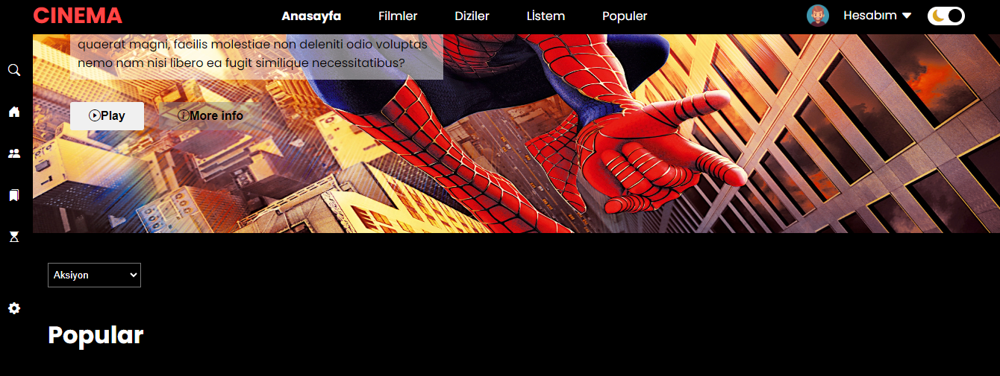
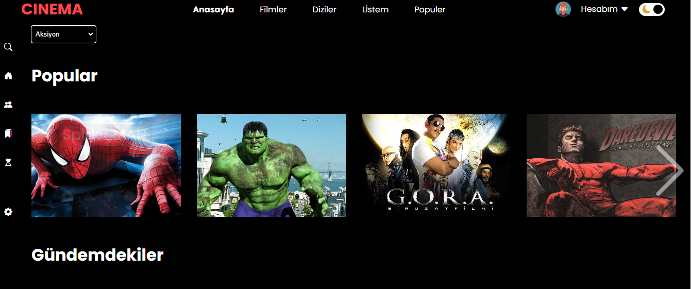
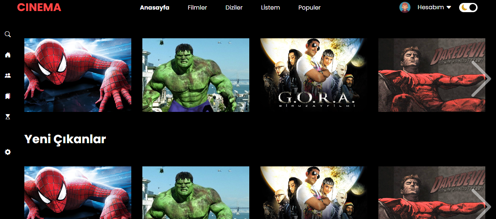
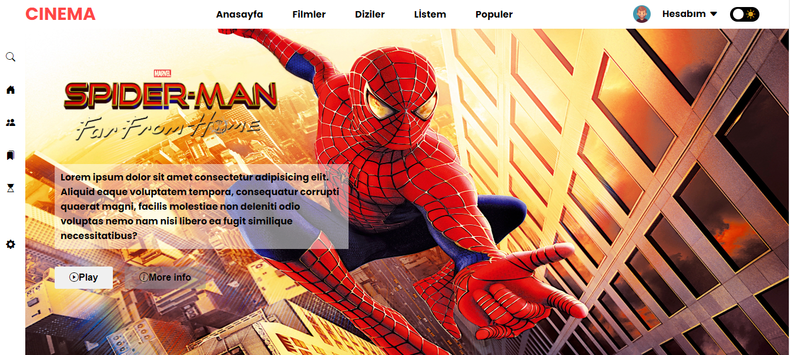

# CinemaPRo

<h1> This is a Film Site </h1>

<h2>Content</h2>

<h3>
    **General information about the films 
    **Can be applied to another concept   
    **Can be used for cinemas and film industry  
    **You can reach information about films which you  interested 
    **contains area where you will keep the movies you want to watch  
    **you can choose movie genre with select section   
    **There are sperated areas to follow new releases,popular movies   

   
**CONTAINS;** 
** film list   
**account and profile  
**side and navbars 
**films details 

    
 
   

</h3>

<h2>Used technologies</h2>

<h3>
*** HTML5 And CCS were used *** 
***made dynamic with javaScript  
***white and black mode with Js  
***easy transition between movies with slide feature 
*** Enriched with google fonts and Font awesome*** 
*** All of responsive designe*** 
    
</h3>

<h2>video gif</h2>

<h2>ScreenShots</h2>

